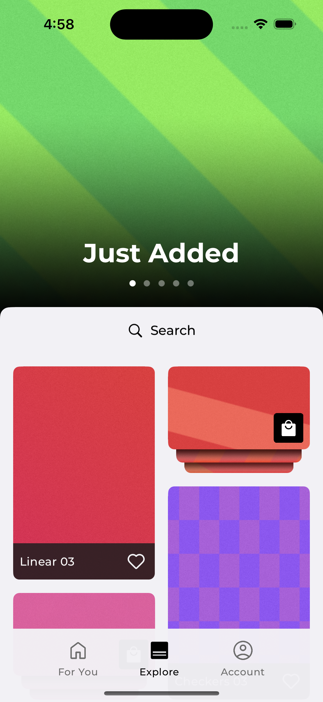
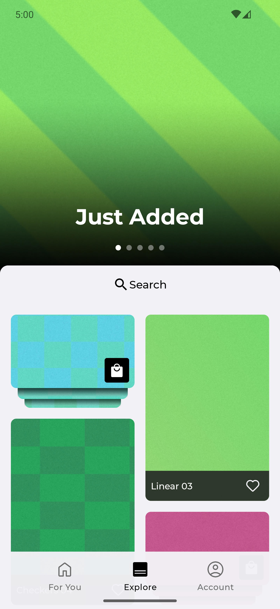
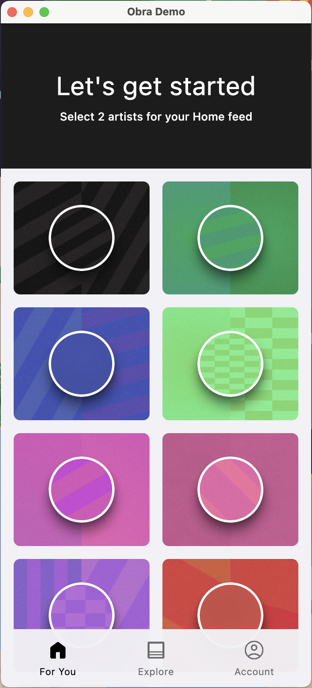

# WallApp

---

WallApp is an open-source release of the code that powered the Panels wallpaper app. 
This project has been released to the community with the intention of serving as a reference implementation and learning resource for building production-ready Kotlin Multiplatform apps. You are free to use this code in your own projects, subject to the terms of the Apache-2.0 license.

The project officially supports iOS and Android, with an experimental JVM desktop build included.

The project is primarily written in Kotlin and Swift.

iOS:<br/>


Android:<br/>


Desktop (Prototype):<br/>


## Architecture Overview

The project uses platform-native UI on each platform, with shared non-UI code handled by Kotlin Multiplatform.

- **iOS** — All UI and navigation is written in SwiftUI/AppKit (with the exception of a ~3 error/popup screens that use ComposeUI).
- **Android** — The UI is built with Jetpack Compose UI (100%) (with the exception of AdMob ads, which use the native Android SDK).
- **Desktop (JVM)** — Experimental support via Compose.

Under the hood, Kotlin Multiplatform provides the shared business logic: data models, networking, dependency injection, and storage. This allows each platform to keep its UI fully native while sharing as much non-UI code as possible. 

See [./doc/project-structure.md](./doc/project-structure.md) for an overview of the project structure.
See [./doc/faq.md](./doc/faq.md) for answers to some common questions.

## What you can learn

This project is an example of how to build and maintain a large-scale, highly-performant, production-ready Kotlin Multiplatform app.  

It showcases real-world integrations and design patterns, such as:

- Cross-platform architecture — clean separation of shared KMP business logic and platform-specific UI layers and dependency injection.
- Multiple approaches to API design — illustrating how to structure Kotlin APIs and provide platform-specific implementations (in Kotlin or Swift as appropriate).
- Multiplatform interfaces around platform-specific libraries — wrapping native SDKs in a consistent shared abstraction.
- Project structure — organized into logical domains and modules for clarity, scalability, and maintainability.
- Deep Firebase integration — Authentication, Firestore, Remote Config, and Storage across Android and iOS. See [./doc/firebase-usage.md](./doc/firebase-usage.md) for details.
- Monetization — In-app purchases and subscriptions via [RevenueCat](https://www.revenuecat.com/).
- Advertising — AdMob native ads and reward ads.
- Utility and helper classes
 
*Note: Much of this code was written in 2023–2024. The Kotlin Multiplatform ecosystem continues to evolve, and some libraries or patterns here may have newer alternatives.*

## Setup

See [./doc/setup.md](./doc/setup.md) for detailed instructions on running the app on Android, iOS, and Desktop.

## Build verification (CLI)

Use these commands to verify the code compiles after changes. Run the platform(s) you are actively touching.

### Individual Platform Commands

- Android (Debug compile/build): `./gradlew :app:android:assembleDebug`
- Desktop (JVM compile): `./gradlew :app:desktop:compileKotlin`
- iOS (Debug build via Xcode - Simulator): `./script/ios_build dev d`

### Unified Build Script

For convenience, you can use the unified build script:

```bash
# Build specific platform
./script/build_debug android
./script/build_debug desktop
./script/build_debug ios

# Build all platforms
./script/build_debug all
```

## Third Party Notices

This project makes use of a number of open source libraries and tools from the Kotlin Multiplatform and Android ecosystems. A complete list of dependencies and licenses is available in [OssLicenses.kt](./shared/data/content/src/commonMain/kotlin/wallapp/data/osslicense/OssLicenses.kt).

## Art Acknowledgements

This demo uses the following assets:
* [Free Confetti Falling Animation](https://lottiefiles.com/free-animation/confetti-falling-qpHlaHa8pw) by Rohith R Krishnan
* [Free Loading Animation](https://lottiefiles.com/free-animation/loading-e2j1A8oi6J) by A.Basit
* [Material Icons](https://fonts.google.com/icons) by Google

Icons in the project are a combination of Material Icons and custom icons from the original project.

All wallpapers in this demo were generated programmatically.


## Contributions

Pull requests are welcome. Our hope is that this project will continue to evolve alongside the latest Kotlin Multiplatform programming paradigms and serve as an educational resource for the community.

Note that contributions here do not flow back into the Panels app itself.

## Trademarks

The "Panels" name and logo are trademarks of [Panels Wallpaper Mobile App LLC](https://panels.art). This repository grants use of the source code but does not grant rights to the "Panels" name, logo, or other trademarks such as MKBHD or Marques Brownlee.

## License

This project is licensed under the Apache-2.0 License. See [LICENSE](./LICENSE) for details.

```
Copyright 2025 Panels Wallpaper Mobile App LLC

Licensed under the Apache License, Version 2.0 (the "License");
you may not use this file except in compliance with the License.
You may obtain a copy of the License at

    http://www.apache.org/licenses/LICENSE-2.0

Unless required by applicable law or agreed to in writing, software
distributed under the License is distributed on an "AS IS" BASIS,
WITHOUT WARRANTIES OR CONDITIONS OF ANY KIND, either express or implied.
See the License for the specific language governing permissions and
limitations under the License.
```
