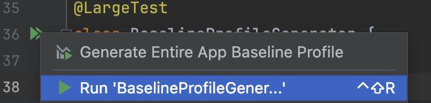
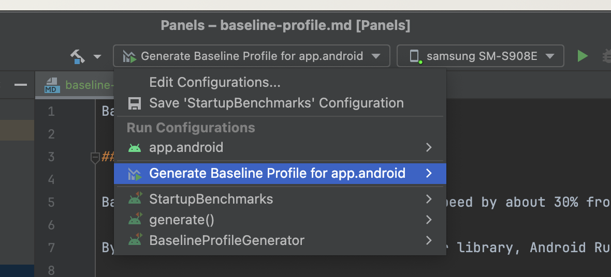

### Baseline Profiles Overview

Baseline Profiles improve code execution speed by approximately 30% from the first launch by bypassing interpretation and just-in-time (JIT) compilation steps for included code paths.

By including a Baseline Profile in an app or library, Android Runtime (ART) can optimize specified code paths through Ahead-of-Time (AOT) compilation, providing performance enhancements for every new user and every app update. This Profile Guided Optimization (PGO) enables apps to optimize startup, reduce interaction jank, and improve overall runtime performance for users from the first launch.

For More Details: [Baseline Profiles Overview](https://developer.android.com/topic/performance/baselineprofiles/overview)

## Simple Usage

1. Run `./script/generate_baseline`, which outputs an updated baseline profile to `app/android/src/main/baseline-prof.txt`

### To view/analyze results:
1. Open `./baselineprofile/src/main/java/com/example/baselineprofile/StartupBenchmarks.kt` in Android Studio.
2. With a physical Android device connected via ADB, click on "Run 'StartupBenchmarks'".

## Manual Usage

### Generate Baseline Report for Current Build Variant:

1. Navigate to `./baselineprofile/src/main/java/com/example/baselineprofile/BaselineProfileGenerator.kt`.
2. Click on "Run 'BaselineProfileGenerator'".
   

### Generate Baseline Report for All Build Variants:

1. Select 'Generate Baseline Profile for app.android'.
   
2. Click on "Run".

### After Generating Baseline Report:

1. Locate the HRF file in the build folder of the module where you generated the profile: `[module]/build/outputs/managed_device_android_test_additional_output/[device]`.
   Profiles follow the `[class name]-[test method name]-baseline-prof.txt` naming pattern, e.g., `BaselineProfileGenerator-startup-baseline-prof.txt`.
2. Copy the generated profile to `app/android/src/main/` and rename the file to `baseline-prof.txt`.
3. Go to `./baselineprofile/src/main/java/com/example/baselineprofile/StartupBenchmarks.kt`.
4. Click on "Run 'StartupBenchmarks'".